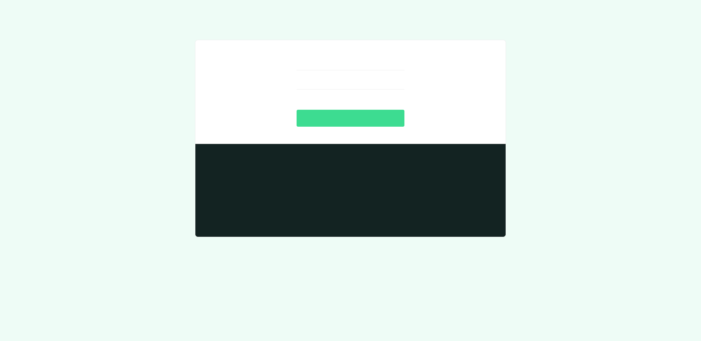
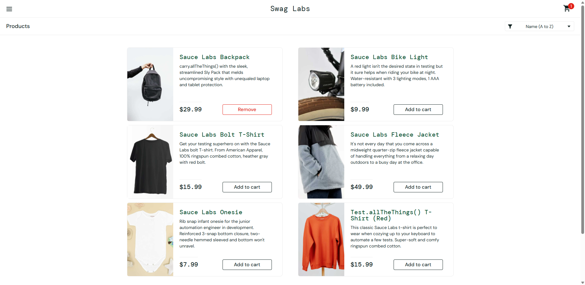

# QA Automation Framework — Selenium · pytest · API · Docker · CI

An end-to-end test automation framework that exercises a **web UI** and a
**REST API**, using the **Page Object Model**, running **in parallel** on a
**Dockerized Selenium Grid**, wired into **GitHub Actions CI**, with **Allure**
reporting and full **STLC documentation**.

> Applications under test (public, stable, built for automation practice):
> - UI — [SauceDemo / Swag Labs](https://www.saucedemo.com)
> - API — [restful-booker](https://restful-booker.herokuapp.com)

**Status:** ✅ 32/32 tests passing — 17 UI (Selenium) · 12 API (requests) · 3 BDD (Gherkin). Verified sequential local runtime ~147s on headless Chrome.

### Screenshots

| Login page | Product added to cart |
|---|---|
|  |  |

Regenerate anytime with `python scripts/capture_screenshots.py`.

---

## Highlights

| Capability | How it's demonstrated |
|-----------|------------------------|
| Selenium WebDriver | UI suite driving SauceDemo via POM |
| pytest framework | fixtures, markers, parametrization, hooks |
| Page Object Model | `pages/` — one class per page, locators isolated |
| API testing | `requests`-based `BookingClient`, full CRUD + negatives |
| BDD / Gherkin | `tests/features/login.feature` via pytest-bdd |
| Parallel execution | `pytest-xdist` (`-n`) |
| Cross-browser infra | Selenium Grid (Chrome + Firefox nodes) in Docker |
| Data-driven | login cases from JSON, checkout data from CSV |
| Reporting | Allure (primary) + pytest-html (fallback) |
| CI/CD | GitHub Actions: smoke gate → full Grid run → Allure artifact |
| Flaky mitigation | explicit `WebDriverWait`, per-test isolation, bounded reruns |

## Project structure

```
qa-automation-framework/
├── pages/                 Page Objects (base, login, inventory, cart, checkout)
├── tests/
│   ├── ui/                Selenium tests (login, cart, checkout, sorting)
│   ├── api/               requests tests (auth, CRUD, negatives) + BookingClient
│   └── features/          Gherkin .feature + step definitions
├── data/                  external JSON/CSV for data-driven tests
├── docs/                  test plan, test cases, defect log  (STLC paperwork)
├── reports/               Allure output (generated)
├── .github/workflows/     GitHub Actions CI
├── conftest.py            driver + config fixtures, screenshot-on-failure hook
├── pytest.ini             markers & options
├── docker-compose.yml     Selenium Grid (hub + chrome + firefox) + test runner
├── Dockerfile             test-runner image
└── requirements.txt
```

## Quick start (local)

```bash
# 1. Create a virtual environment
python -m venv .venv
# Windows PowerShell:
.venv\Scripts\Activate.ps1
# macOS/Linux:
# source .venv/bin/activate

# 2. Install dependencies
pip install -r requirements.txt

# 3. Configure (optional — sensible defaults are built in)
cp .env.example .env        # then edit if needed

# 4. Run the smoke suite against local headless Chrome
pytest -m smoke
```

Selenium 4 ships **Selenium Manager**, so the correct chromedriver is fetched
automatically — no manual driver download. You just need Chrome installed.

## Running slices of the suite (markers)

```bash
pytest -m smoke          # fast health check
pytest -m regression     # full regression pass
pytest -m api            # API layer only (no browser needed)
pytest -m ui             # browser tests only
pytest -m "ui and not regression"
pytest -m bdd            # Gherkin scenarios
```

## Parallel + cross-browser on Dockerized Selenium Grid

```bash
# Bring up the Grid (hub + chrome + firefox) and run the whole suite in parallel
docker compose up --build --abort-on-container-exit --exit-code-from tests

# Or just the Grid, and watch sessions live at http://localhost:4444
docker compose up selenium-hub chrome firefox
```

To run the local suite against the Grid without Docker-building the tests:

```bash
# .env: RUN_MODE=grid  and  SELENIUM_REMOTE_URL=http://localhost:4444/wd/hub
pytest -n 4 --dist loadfile
```

> **Note on parallelism:** parallel execution is designed for the isolated
> browser containers of the Selenium Grid. Running many headless Chrome
> instances *locally* on one dev laptop is CPU-bound and can itself cause
> timing failures — which is precisely why the Grid exists. Take your real
> "runtime cut from X to Y" measurement from a Grid / CI run, not from local
> parallel Chrome on a busy machine. The retry strategy (`pytest --reruns N`,
> via `pytest-rerunfailures`) absorbs genuine infrastructure blips.

## Allure reporting

```bash
# Results are written to reports/allure-results by every run (see pytest.ini).
# Render and open the HTML report (requires the Allure CLI):
allure serve reports/allure-results
```

Install the Allure CLI: `scoop install allure` (Windows) ·
`brew install allure` (macOS). UI-test failures auto-attach a screenshot.

## Flaky-test handling (design note)

The framework treats flakiness as a first-class concern (and pairs with a
companion ML project that *predicts* flaky tests):

- **Explicit waits only.** `pages/base_page.py` uses `WebDriverWait` +
  `expected_conditions` — never `time.sleep()`. This removes the timing races
  behind most Selenium flakiness.
- **Isolation.** A fresh, function-scoped browser per test; API bookings are
  created and torn down per test.
- **Bounded retry.** `pytest-rerunfailures` can re-run a genuinely flaky test
  (`pytest --reruns 2`) to separate infra blips from real defects.

See [`docs/test-plan.md`](docs/test-plan.md) §6 for the full rationale.

## Documentation (STLC)

- [`docs/test-plan.md`](docs/test-plan.md) — scope, approach, tools, risks
- [`docs/test-cases.md`](docs/test-cases.md) — the test case catalogue
- [`docs/defect-log.md`](docs/defect-log.md) — severity-rated defects found

## Secrets

API credentials are read from environment variables / `.env` (git-ignored) and,
in CI, from GitHub Actions **secrets** (`API_USERNAME`, `API_PASSWORD`). No
tokens are committed.

## CI

`.github/workflows/tests.yml` runs on every push/PR:
1. **smoke** — fast headless-Chrome gate
2. **full-suite-on-grid** — full parallel run on the Dockerized Grid, publishing
   the Allure results and a self-contained HTML report as build artifacts.

## License

All rights reserved © 2026 Ishna S.

This code is published for portfolio and review purposes only. No license is
granted to use, copy, modify, or distribute it without the author's written
permission.
